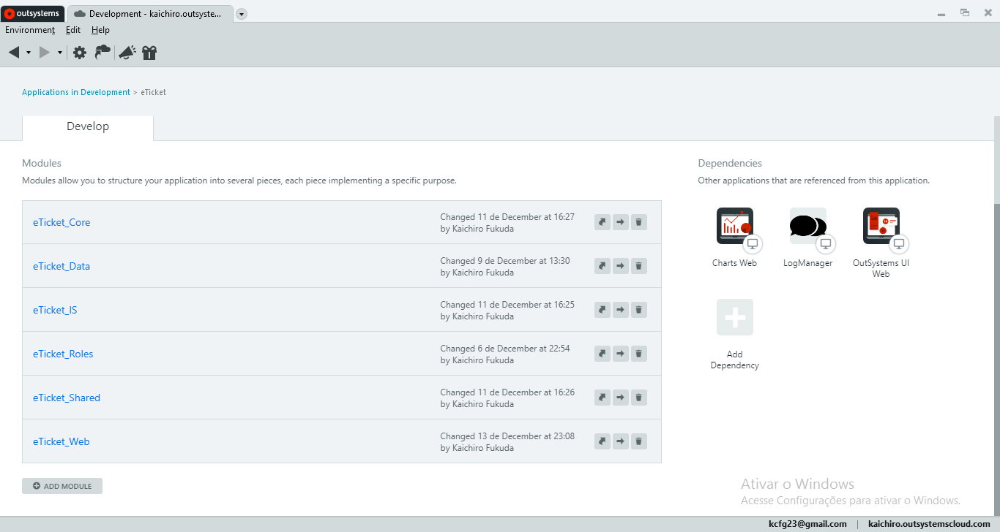
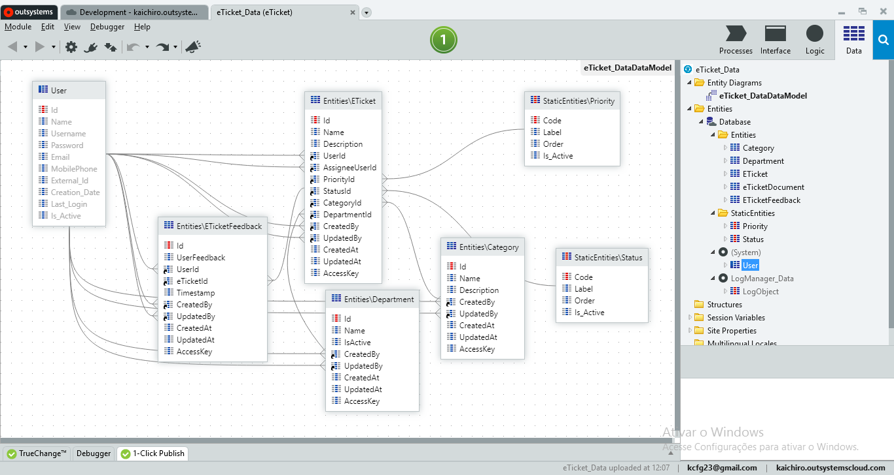
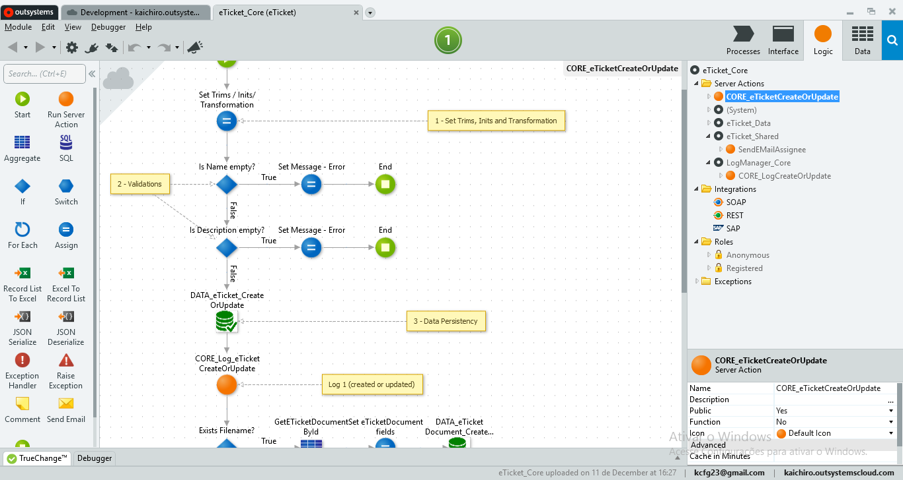
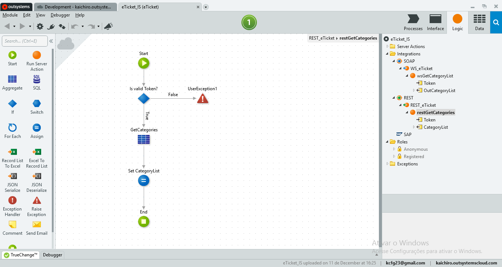
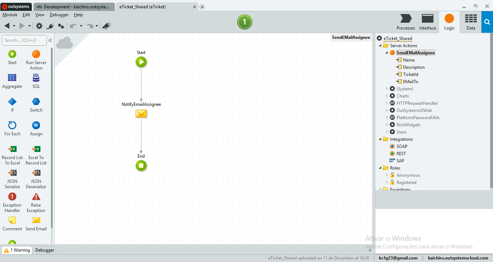
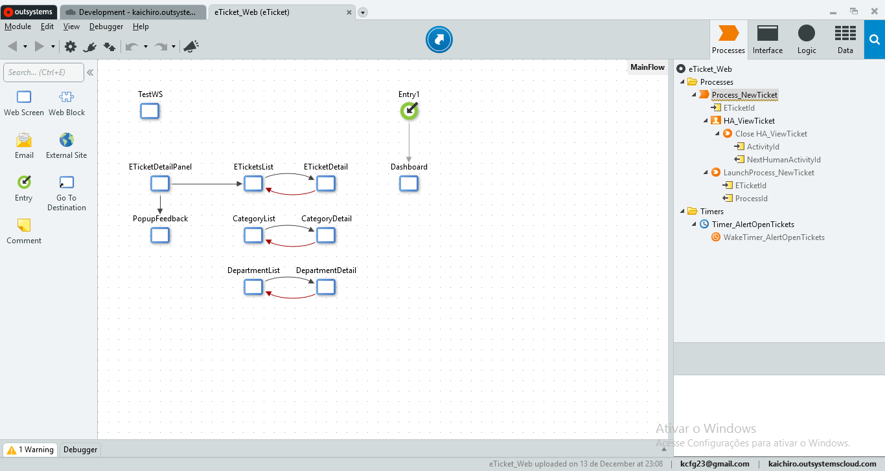

It is basic and intermediate to start a web project in OutSystems, structuring it in layers, aiming at scalability and evolutionary maintenance of the project, in practice, as well as developing a ticket opening and tracking; - Relationship with entities of the following type was implemented: [Categoy, Department]; - Email triggering for AssignneUser (with ticket information created) has been implemented; - We also implemented graphs related to ticket information; - Learn how to analyze ServiceCenter statistics / logs to understand and mediate system performance;

---

###### Project

###### Data module

###### Core module

###### IS module

###### Shared module

###### Web module

---
Access [eTicket here!]([https](https://kaichiro.outsystemscloud.com/eTicket_Web/))
